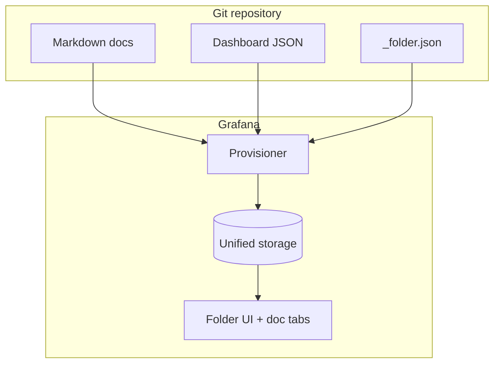

# Architecture

High-level view of how provisioned dashboards reach Grafana.

```mermaid
flowchart TB
    subgraph Source["Git repository"]
        MD[Markdown docs]
        JSON[Dashboard JSON]
        FOLDER[_folder.json]
    end

    subgraph Grafana["Grafana"]
        Provisioner[Provisioner]
        Store[(Unified storage)]
        UI[Folder UI + doc tabs]
    end

    MD --> Provisioner
    JSON --> Provisioner
    FOLDER --> Provisioner
    Provisioner --> Store
    Store --> UI
```
