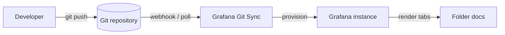

# Mermaid

This folder demonstrates rendered [Mermaid](https://mermaid.js.org/) diagrams
inside provisioned folder documentation. Each tab shows a different diagram
type.

## Git Sync flow

## Tabs in this folder

| Tab | Diagram type |
|-----|--------------|
| README | Flowchart |
| Architecture | Component / flowchart |
| Sequence | Sequence diagram |
| States | State diagram |
