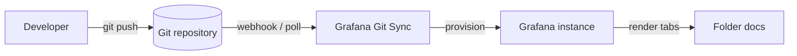
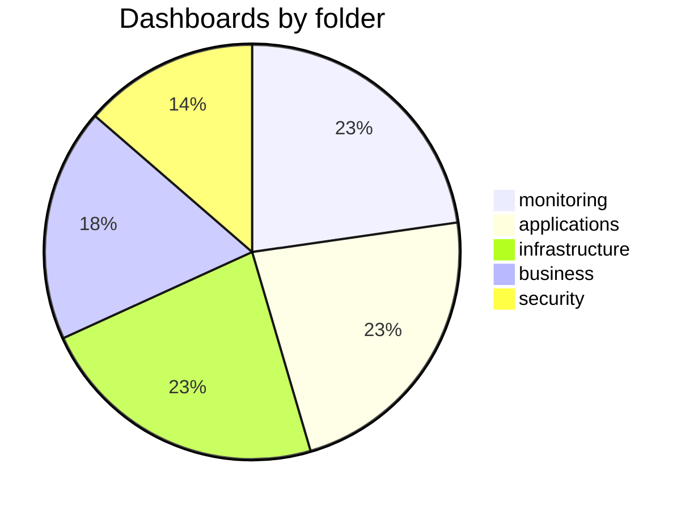
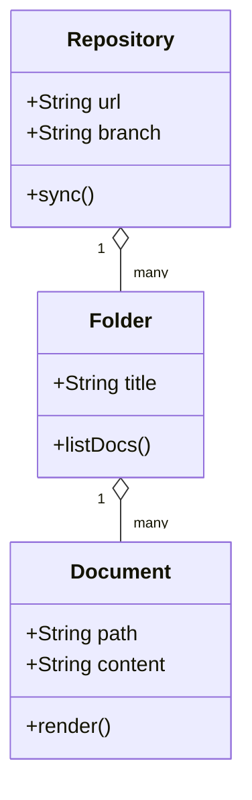
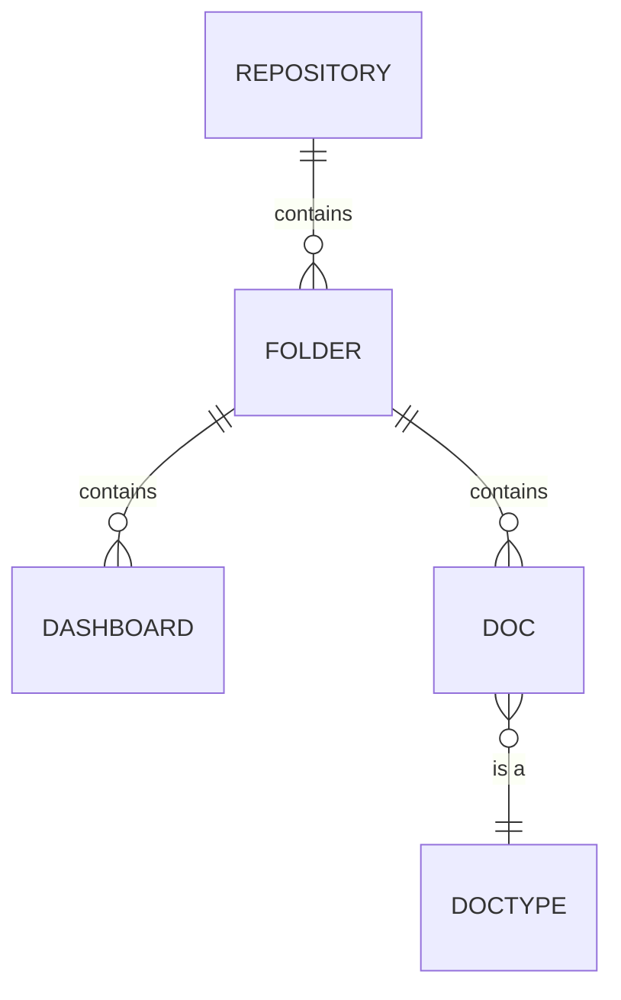
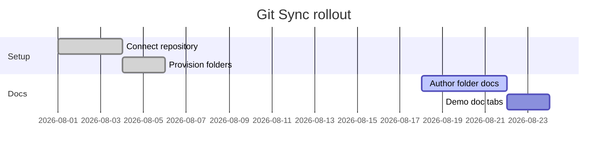
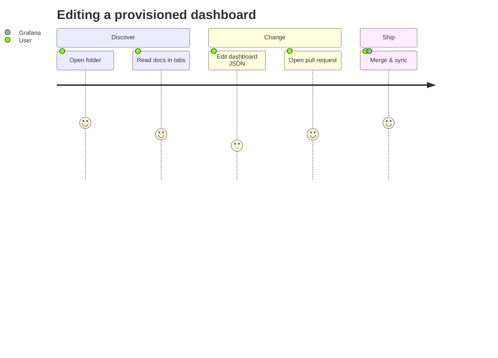
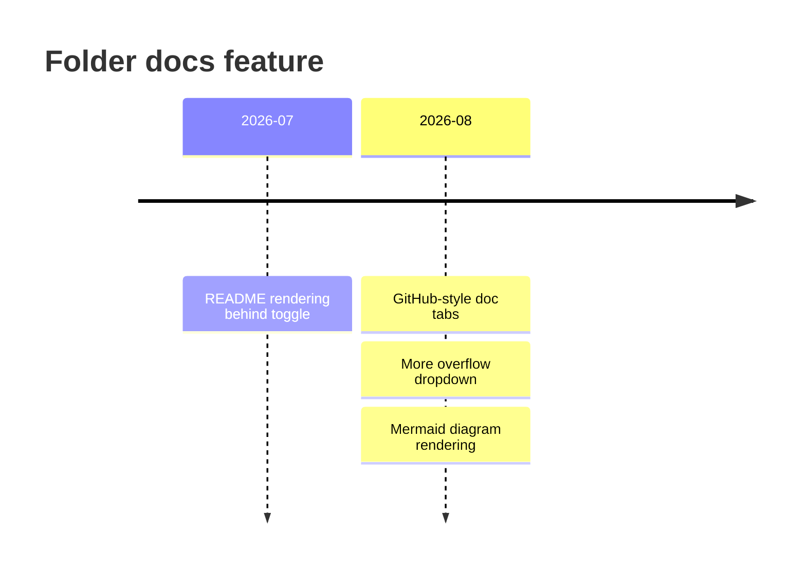
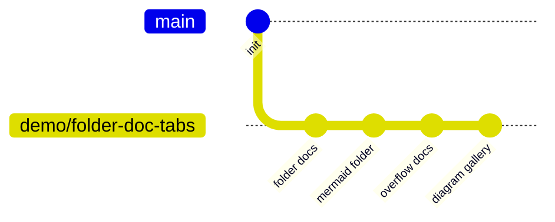

# Mermaid

This folder demonstrates rendered [Mermaid](https://mermaid.js.org/) diagrams
inside provisioned folder documentation. Each tab shows a different diagram
type.

## Git Sync flow



## More diagram types

A gallery of different Mermaid diagram types rendered from a single doc.

### Pie chart



### Class diagram



### Entity relationship diagram



### Gantt chart



### User journey



### Timeline



### Git graph



### Invalid diagram (error handling)

This block is intentionally malformed to check how the renderer handles a
diagram it cannot parse — it should surface an error rather than break the page.

```mermaid
flowchart LR
    A[Start] --> B{Decision
    B -->|yes| C((End)
    B ==> not-a-real-syntax >>> D
    C --| dangling
```

## Tabs in this folder

| Tab | Diagram type |
|-----|--------------|
| README | Flowchart + gallery (pie, class, ER, gantt, journey, timeline, git) |
| Architecture | Component / flowchart |
| Sequence | Sequence diagram |
| States | State diagram |
