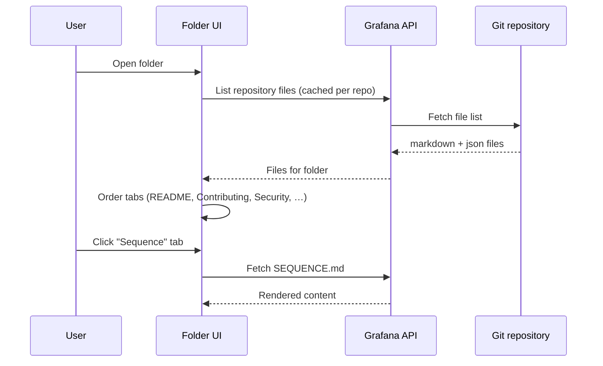

# Sequence

What happens when a user opens a provisioned folder with docs.

```mermaid
sequenceDiagram
    participant U as User
    participant UI as Folder UI
    participant API as Grafana API
    participant Repo as Git repository

    U->>UI: Open folder
    UI->>API: List repository files (cached per repo)
    API->>Repo: Fetch file list
    Repo-->>API: markdown + json files
    API-->>UI: Files for folder
    UI->>UI: Order tabs (README, Contributing, Security, …)
    U->>UI: Click "Sequence" tab
    UI->>API: Fetch SEQUENCE.md
    API-->>UI: Rendered content
```
