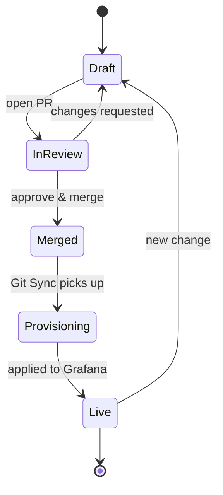

# States

Lifecycle of a dashboard change flowing through Git Sync.

```mermaid
stateDiagram-v2
    [*] --> Draft
    Draft --> InReview: open PR
    InReview --> Draft: changes requested
    InReview --> Merged: approve & merge
    Merged --> Provisioning: Git Sync picks up
    Provisioning --> Live: applied to Grafana
    Live --> Draft: new change
    Live --> [*]
```
